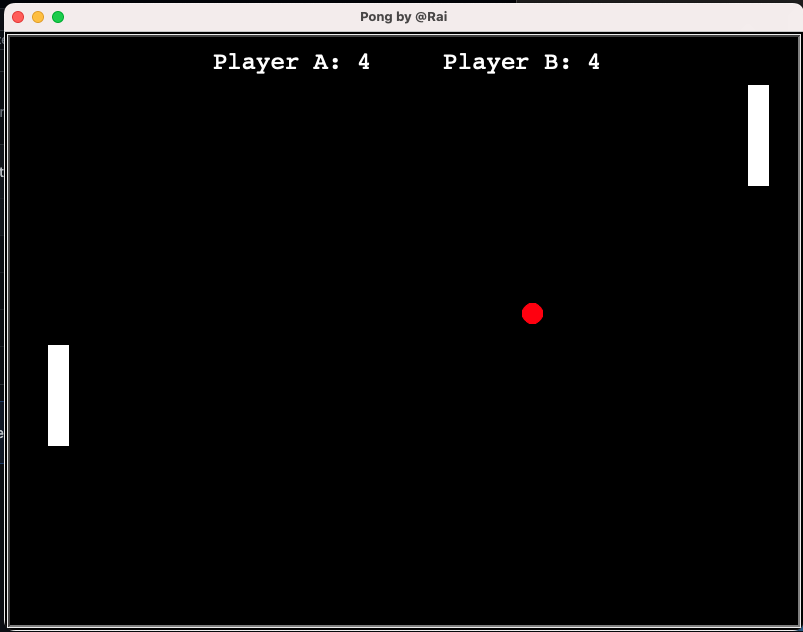

# 🎾 Pong Game

<h2>Main view of the game<h2>
<div style="text-align: center">

</div>

## A Classic Recreation

Welcome to Pong Game, a classic recreation of the iconic Pong game built with Python and the incredible `turtle` library. This project was created to enhance coding skills and explore the capabilities of the `turtle` library. Pong Game brings back nostalgic memories of the dawn of video gaming and allows you to have some fun while improving your Python programming abilities.

- 📅 Year: 2021
- 👨‍💻 Creator: jrdelrio (Full Stack Developer)

## Game Overview

Pong is a simple yet addictive two-player game created by [Allan Alcorn](https://en.wikipedia.org/wiki/Allan_Alcorn), an engineer working at Atari, Inc. Pong was released as an arcade game in 1972, making it one of the earliest video games ever created.. The objective is straightforward: use your tennis racket to bounce the ball back and forth, competing against your opponent. The first player to miss the ball loses a point. The game continues until one player reaches the set score or until you decide it's time to stop. It's a great way to test your reflexes and have a blast with a timeless classic.

## 🔧 Requirements

Before diving into the game, ensure you have the following prerequisites installed:

1. [Python 3.x or higher](https://www.python.org/downloads/): Pong Game is built using Python, so make sure you have it installed on your system.

2. [Turtle Library](https://docs.python.org/3/library/turtle.html): This project relies on the `turtle` library, which is included in Python's standard library. No need for additional installations.


##  🎮 Controlls

|               | Player A   | Player B |
|:-------------:|:-------------:|:---------:|
| Move Up      |       W       |      ⬆️   |
| Move Down      |       S       |      ⬇️   |


## Cloning the Repository

To get started and run Pong Game on your local machine, follow these simple steps:

```bash
# Clone the repository
$ git clone https://github.com/your-username/pong-game.git

# Navigate to the project directory
$ cd pong-game
```

## Running the game

```bash
$ python3 Pong.py
```

## ENJOY playing Pong and have fun improving your Python skills!
Made with ❤️ by jrdelrio | Full Stack Developer

Feel free to fork, contribute, or share your high scores with the community. Let the Pong Game nostalgia begin! 🚀🎮
